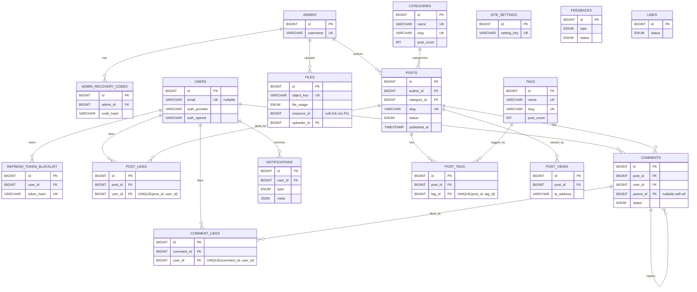

```mermaid
erDiagram
  ADMINS ||--o{ ADMIN_RECOVERY_CODES : has
  ADMINS ||--o{ POSTS : authors
  ADMINS ||--o{ FILES : uploads

  USERS ||--o{ REFRESH_TOKEN_BLACKLIST : owns
  USERS ||--o{ POST_LIKES : likes
  USERS ||--o{ COMMENTS : writes
  USERS ||--o{ COMMENT_LIKES : likes
  USERS ||--o{ NOTIFICATIONS : receives

  CATEGORIES ||--o{ POSTS : categorizes
  POSTS ||--o{ POST_TAGS : has
  TAGS ||--o{ POST_TAGS : tagged_by

  POSTS ||--o{ POST_LIKES : liked_by
  POSTS ||--o{ POST_VIEWS : viewed_by
  POSTS ||--o{ COMMENTS : has

  COMMENTS ||--o{ COMMENTS : replies
  COMMENTS ||--o{ COMMENT_LIKES : liked_by

  %% Standalone (no FKs)
  SITE_SETTINGS
  FEEDBACKS
  LINKS

  ADMINS {
    BIGINT id PK
    VARCHAR username UK
  }

  ADMIN_RECOVERY_CODES {
    BIGINT id PK
    BIGINT admin_id FK
    VARCHAR code_hash
  }

  USERS {
    BIGINT id PK
    VARCHAR email UK "nullable"
    VARCHAR auth_provider
    VARCHAR auth_openid
  }

  REFRESH_TOKEN_BLACKLIST {
    BIGINT id PK
    BIGINT user_id FK
    VARCHAR token_hash UK
  }

  CATEGORIES {
    BIGINT id PK
    VARCHAR name UK
    VARCHAR slug UK
    INT post_count
  }

  TAGS {
    BIGINT id PK
    VARCHAR name UK
    VARCHAR slug UK
    INT post_count
  }

  POSTS {
    BIGINT id PK
    BIGINT author_id FK
    BIGINT category_id FK
    VARCHAR slug UK
    ENUM status
    TIMESTAMP published_at
  }

  POST_TAGS {
    BIGINT id PK
    BIGINT post_id FK
    BIGINT tag_id FK
    "UNIQUE(post_id, tag_id)"
  }

  POST_LIKES {
    BIGINT id PK
    BIGINT post_id FK
    BIGINT user_id FK
    "UNIQUE(post_id, user_id)"
  }

  POST_VIEWS {
    BIGINT id PK
    BIGINT post_id FK
    VARCHAR ip_address
  }

  COMMENTS {
    BIGINT id PK
    BIGINT post_id FK
    BIGINT user_id FK
    BIGINT parent_id FK "nullable self-ref"
    ENUM status
  }

  COMMENT_LIKES {
    BIGINT id PK
    BIGINT comment_id FK
    BIGINT user_id FK
    "UNIQUE(comment_id, user_id)"
  }

  NOTIFICATIONS {
    BIGINT id PK
    BIGINT user_id FK
    ENUM type
    JSON meta
  }

  FILES {
    BIGINT id PK
    VARCHAR object_key UK
    ENUM file_usage
    BIGINT resource_id "soft link (no FK)"
    BIGINT uploader_id FK
  }

  SITE_SETTINGS {
    BIGINT id PK
    VARCHAR setting_key UK
  }

  FEEDBACKS {
    BIGINT id PK
    ENUM type
    ENUM status
  }

  LINKS {
    BIGINT id PK
    ENUM status
  }
```

